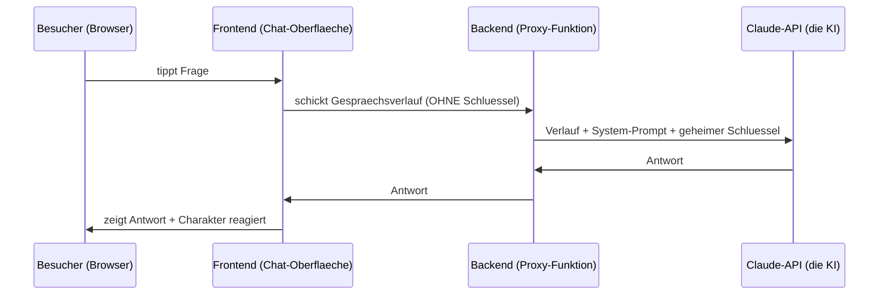

# Bauplan — Dein KI-Agent (komplette Anleitung)

Stand: 2026-06-26 · Für: Liam · Projektordner: `C:\Users\liamb\Documents\ki-agent-mvp\`

> Update 2026-06-26: Architektur auf **datengetrieben** umgebaut — die Firmen-Infos
> stehen nicht mehr im Code, sondern als Daten in `data/<firma>.json`. Damit kriegt
> jede Firma einen eigenen Agenten und der Weg zur verkaufbaren SaaS ist ein Anbau,
> kein Neubau. Betroffen: Abschnitte 2, 3, 5, 7.

> Diese Datei erklaert ALLES so einfach wie moeglich: was du baust, wie es
> funktioniert, wie es aufgebaut ist und was du genau tun musst. Ganz unten
> gibt es ein Woerterbuch fuer alle Fachbegriffe.

---

## 0. In einem Satz
Eine Webseite mit einem freundlichen Charakter, der Besucher begruesst, durch
die Marke fuehrt und ihre Fragen beantwortet — angetrieben von einer KI (Claude).

---

## 1. Die Idee (was wir bauen und warum)

**Das grosse Ziel (deine Marke):** eine App, die *jeder* Firma einen eigenen
Webseiten-Agenten mit eigenem Charakter gibt. Der Kern ist nicht Support,
sondern **emotionale Bindung** — der Charakter ist die Beziehung zur Marke,
die Fragen-Antworten sind nur der Anlass fuer Kontakt.

**Was der Agent koennen soll (MVP-Verhalten):**
- **Begruesst** den Besucher proaktiv.
- **Fuehrt** ihn durch die Marke ("Speisekarte? Oeffnungszeiten? Reservieren?").
- **Antwortet** auf Fragen — nur aus den echten Firmen-Infos.
- *(Gedaechtnis fuer Wiederkehrer = spaeter, Phase 2.)*

**Das MVP-Ziel (was wir jetzt zuerst bauen):** EIN funktionierender Agent auf
einer Beispiel-Seite. Als Beispiel-Firma nehmen wir dein fiktives Restaurant
"Salbei". Erst Funktion, dann Design.

---

## 2. Wie es funktioniert (der Ablauf, einfach erklaert)

Stell dir ein Restaurant vor:
- **Der Gast** = der Besucher im Browser.
- **Der Tresen** = die Chat-Oberflaeche (das, was man sieht).
- **Der Kellner mit dem Schluessel zur Kueche** = das Backend (eine kleine
  Funktion auf dem Server).
- **Die Kueche** = die KI (Claude), die die Antwort "kocht".

Der Gast sagt dem Tresen seine Frage. Der Tresen gibt sie dem Kellner. Der
Kellner haelt einen **Geheimschluessel** (den darf der Gast nie sehen), geht
damit in die Kueche, holt die Antwort und bringt sie zurueck an den Tresen.

**Der Datenfluss Schritt fuer Schritt:**
1. Besucher tippt eine Frage ins Chatfenster.
2. Das Frontend schickt den **Gespraechsverlauf** + die **firmaId** (welche Firma
   dieser Agent vertritt) an das Backend.
3. Das Backend laedt die passenden **Firmen-Daten** (`data/<firmaId>.json`), baut
   daraus den **System-Prompt** (Charakter + Fakten) und haengt den **geheimen
   API-Schluessel** an.
4. Das Backend ruft die **Claude-API** auf.
5. Claude schickt die Antwort zurueck ans Backend.
6. Das Backend gibt die Antwort ans Frontend.
7. Das Frontend zeigt die Antwort — spaeter reagiert der Charakter dazu.



**Warum braucht es ueberhaupt ein Backend?**
Weil der API-Schluessel geheim bleiben muss. Wuerde das Frontend (der Browser)
die KI direkt anrufen, koennte jeder den Schluessel auslesen und auf deine
Kosten Anfragen stellen. Das Backend ist der "Kellner", der den Schluessel
versteckt haelt.

**Was ist der "System-Prompt"?**
Das ist die eigentliche "Intelligenz" deines Agenten — aber es ist nur **Text**.
Darin steht: wer der Charakter ist, wie er spricht, und alle Fakten ueber die
Firma. Die KI liest diesen Text bei jeder Anfrage und verhaelt sich danach.
Du programmierst das Verhalten also nicht — du *beschreibst* es in Worten.

Neu (datengetrieben): Diesen Text tippst du nicht mehr von Hand in den Code. Eine
Funktion (`baueSystemPrompt`) setzt ihn automatisch aus den Daten der jeweiligen
Firma (`data/<firma>.json`) zusammen. Code bleibt gleich — nur die Daten wechseln.

---

## 3. Wie es aufgebaut ist (die Teile + Dateien)

**Die 4 Bausteine:**
1. **Frontend** — die Chat-Oberflaeche (HTML/CSS/JS). Laeuft im Browser.
2. **Backend** — die Proxy-Funktion. Laeuft auf dem Server, haelt den Schluessel.
3. **Claude-API** — das fertige Sprachmodell (du baust es NICHT selbst).
4. **Wissen + Charakter** — steht als **Daten** in `data/<firma>.json` (nicht im
   Code). Der Code baut daraus den System-Prompt. Kein Datenbank-Aufwand im MVP.

**Die Dateien im Projektordner:**

| Datei | Was sie macht | Laeuft wo |
|---|---|---|
| `public/index.html` | Chat-Oberflaeche; schickt `firmaId` + Verlauf mit | Browser |
| `data/<firma>.json` | **Wissen + Charakter je Firma** (hier pflegst du die Infos) | (Daten) |
| `netlify/functions/chat.js` | Proxy: laedt Firma, baut Prompt, ruft die API | Server |
| `netlify/functions/lib/firmen.js` | Registry: welche Firmen gibt es? (spaeter: Datenbank) | Server |
| `netlify/functions/lib/baueSystemPrompt.js` | baut aus den Daten den System-Prompt | Server |
| `netlify.toml` | sagt Netlify, wo Seite/Funktion liegen + dass `data/` mitgeht | (Konfig) |
| `.env` | dein geheimer API-Schluessel (NIE teilen/committen) | nur lokal |
| `.env.example` | Vorlage fuer die `.env` | (Vorlage) |
| `.gitignore` | sorgt dafuer, dass `.env` nie ins Git kommt | (Schutz) |
| `README.md` | Kurzanleitung zum Starten | (Doku) |
| `BAUPLAN.md` | diese ausfuehrliche Anleitung | (Doku) |

**Wichtig zu verstehen:** Alles im Ordner `public/` sieht der Besucher
(Browser). Alles in `netlify/functions/` laeuft versteckt auf dem Server — dort
und nur dort lebt der Schluessel.

### Datengetrieben: eine Firma = eine Datei (der wichtigste Bau-Entscheid)

Die Firmen-Infos stehen bewusst **getrennt vom Code**:
- **Daten** (`data/salbei.json`, `data/nordlicht.json`, ...): Name, Ton, Fakten,
  FAQ einer Firma. Das ist das, was sich pro Firma unterscheidet.
- **Code** (`baueSystemPrompt.js`): macht aus diesen Daten den Prompt-Text. Fuer
  ALLE Firmen identisch.
- **Registry** (`firmen.js`): die Liste "welche Firmen gibt es?".

Warum das so wichtig ist:
- **Neue Firma = JSON anlegen + 2 Zeilen in `firmen.js`.** Kein Code kopieren.
- **Der Weg zur verkaufbaren SaaS ist ein Anbau, kein Neubau:** Wenn sich Firmen
  spaeter einloggen und ihre Infos selbst eingeben, aendert sich nur EINE Stelle —
  `firmen.js` liest dann aus einer Datenbank statt aus Dateien. `baueSystemPrompt`,
  `chat.js` und das Frontend bleiben unveraendert.
- **Mehrere Firmen testbar ohne Login:** `?firma=nordlicht` an die URL haengen.
  Das beweist Mehrmandantenfaehigkeit (eine App, viele Kunden) schon im MVP.

---

## 4. Was DU tun musst (Schritt fuer Schritt, von Null bis es laeuft)

**Voraussetzungen — schon erledigt:**
- [x] Node.js installiert (v22)
- [x] npm installiert (v10)
- [x] Netlify CLI installiert (v26)
- [x] Projektgeruest erstellt (alle Dateien oben)

**Jetzt deine Schritte:**

1. **API-Schluessel holen (T1):**
   - Auf `console.anthropic.com` gehen, Konto erstellen oder einloggen.
   - Unter **Billing** ein kleines Guthaben aufladen (ein paar Franken reichen).
   - Unter **API Keys -> Create Key** einen Schluessel erstellen und kopieren.

2. **Schluessel eintragen:**
   - Im Projektordner die Datei `.env.example` kopieren und in `.env` umbenennen.
   - Den Schluessel hinter `ANTHROPIC_API_KEY=` einfuegen.
   - Speichern. (Diese Datei bleibt geheim — sie wird nie hochgeladen.)

3. **Starten:**
   - Terminal im Ordner oeffnen:
     ```
     cd C:\Users\liamb\Documents\ki-agent-mvp
     netlify dev
     ```
   - Beim ersten Mal evtl. Nachfrage nach Login/Site — fuer lokales Testen
     kannst du das ueberspringen ("skip").
   - Der Browser oeffnet sich (meist `http://localhost:8888`).

4. **Testen:**
   - Frage eingeben, z.B. "Wann habt ihr offen?" -> der Agent antwortet aus den
     Salbei-Fakten.
   - Frage etwas, das NICHT in den Fakten steht -> er sollte ehrlich sagen, dass
     er es nicht weiss (das ist die Anti-Erfindungs-Regel).

**Fertig-Checkliste:**
- [ ] Schluessel geholt und in `.env` eingetragen
- [ ] `netlify dev` gestartet
- [ ] Agent antwortet im Browser
- [ ] Agent erfindet nichts bei unbekannten Fragen

---

## 5. Wie du es anpasst

- **Fakten & Charakter EINER Firma aendern:** in `data/<firma>.json` bearbeiten
  (Name, Ton, Fakten, FAQ). Hier pflegst du die Infos — kein Code noetig.
- **Neue Firma hinzufuegen:** `data/meinefirma.json` anlegen (bestehende Datei als
  Vorlage), dann in `lib/firmen.js` zwei Zeilen ergaenzen (`require` + Eintrag).
  Testen mit `?firma=meinefirma`.
- **Verhalten/Ton fuer ALLE Firmen aendern:** in `lib/baueSystemPrompt.js` den
  Vorlage-Text bearbeiten (z.B. die Verhaltensregeln). Gilt dann fuer alle Firmen.
- **Modell wechseln:** in `chat.js` `model` aendern:
  - `claude-haiku-4-5-20251001` = schnell + guenstig (gut fuer den Start)
  - `claude-sonnet-4-6` = klueger, etwas teurer
- **Antwort-Laenge:** `max_tokens` (z.B. 600) hoeher/niedriger stellen.
- **Persoenlichkeit vs. Genauigkeit:** `temperature` (0.0 = sehr sachlich,
  1.0 = sehr verspielt; 0.5 ist ein guter Mittelweg).

---

## 6. Wie du es ins Internet stellst (Deploy — spaeter)

1. Netlify-Konto erstellen (gratis).
2. Den Ordner mit Netlify verbinden (`netlify deploy` oder ueber die Webseite).
3. **Wichtig:** den Schluessel NICHT als Datei hochladen, sondern im Netlify-
   Dashboard als **Umgebungsvariable** `ANTHROPIC_API_KEY` eintragen.
4. Veroeffentlichen — die Seite hat dann eine echte Internet-Adresse.

---

## 7. Der Weg danach (Roadmap)

**Phase 1 — MVP (jetzt):** ein Agent, der begruesst, fuehrt, antwortet. Laeuft
lokal.

**Phase 2 — Design & Charakter (T7):** den Charakter gestalten (2D, stilisiert),
Avatar einbauen, Reaktionen/Animation (deine Motion-Staerke). Erst jetzt, weil
du jetzt weisst, welche Zustaende es zu gestalten gibt (begruessen, tippt,
freut sich, weiss etwas nicht).

**Phase 3 — Echte Beziehung:** Gedaechtnis (erkennt Wiederkehrer), evtl. RAG
(wenn die Wissensbasis zu gross fuer den System-Prompt wird).

**Phase 4 — Vom Agenten zum Baukasten:** der eigentliche Marken-Kern — eine
Oberflaeche, in der eine Firma ihre Infos eingibt (evtl. Foto) und automatisch
ihren eigenen Charakter-Agenten bekommt. *Das Fundament dafuer steht schon:* weil
Daten und Code getrennt sind, kommt hier nur Login + Datenbank + Eingabe-Formular
DAZU — der Agent selbst (`baueSystemPrompt`, `chat.js`) bleibt unveraendert.
Zusaetzlich noetig: Mehrmandantigkeit sauber trennen, Abrechnung, Datenschutz,
ein Einbett-Code (`<script>`), den Kunden auf ihre Webseite setzen.

---

## 8. Kosten

- **Claude-API:** wenige Rappen pro Gespraech beim Testen (Haiku ist sehr
  guenstig). Du zahlst nur, was du nutzt.
- **Netlify:** Gratis-Stufe reicht fuer Tests und kleine Seiten locker.
- **Tipp:** `max_tokens` begrenzen und beim Testen sparsam sein.

---

## 9. Sicherheit (wichtig)

- **Schluessel geheim halten:** nie in den Browser, nie in ein oeffentliches
  Git, nie an jemanden schicken. Nur in der `.env` (lokal) oder als
  Umgebungsvariable (beim Deploy).
- **Anti-Halluzination:** der System-Prompt sagt klar "antworte nur aus den
  gegebenen Infos, sonst sag, dass du es nicht weisst". Das schuetzt davor,
  dass der Agent falsche Dinge ueber die Firma erfindet.
- **Kosten-Schutz:** `max_tokens`-Limit, spaeter eine einfache Begrenzung, wie
  oft jemand pro Minute fragen darf.

---

## 10. Wenn etwas nicht geht (Fehlerbehebung)

| Problem | Wahrscheinliche Ursache | Loesung |
|---|---|---|
| "ANTHROPIC_API_KEY fehlt" | `.env` fehlt oder leer | Schluessel in `.env` eintragen, `netlify dev` neu starten |
| Senden-Button im Vorschau-Panel macht nichts | Funktion laeuft nur ueber `netlify dev` | mit `netlify dev` starten, dort testen |
| "API-Fehler" / 401 | Schluessel falsch oder kein Guthaben | Schluessel pruefen, Guthaben aufladen |
| "Verbindungsfehler" | Server laeuft nicht | `netlify dev` muss aktiv sein |
| Antwort dauert lange | grosses Modell / lange Antwort | Haiku nutzen, `max_tokens` senken |

---

## 11. Woerterbuch (einfach erklaert)

- **LLM (Large Language Model):** die KI, die Sprache versteht und schreibt
  (hier: Claude). Du nutzt sie fertig, du baust sie nicht.
- **API:** eine Tuer, durch die dein Programm mit einem anderen Dienst (der KI)
  redet.
- **API-Schluessel:** dein persoenliches Passwort fuer diese Tuer. Geheim!
- **Frontend:** der Teil, den der Besucher sieht (Chat-Oberflaeche im Browser).
- **Backend:** der versteckte Teil auf dem Server (haelt den Schluessel, ruft
  die KI).
- **Proxy / Proxy-Funktion:** ein Vermittler. Nimmt die Frage entgegen, ruft
  fuer dich die KI auf, gibt die Antwort zurueck.
- **Serverless / Funktion:** ein kleines Stueck Server-Code, das nur laeuft,
  wenn es gebraucht wird — du musst keinen eigenen Server betreiben.
- **System-Prompt:** der Text, der dem Agenten seinen Charakter und sein Wissen
  gibt. Die "Seele" des Agenten — in Worten, nicht in Code.
- **Umgebungsvariable:** ein geheimer Wert (wie der Schluessel), der ausserhalb
  des Codes gespeichert wird, damit er nicht im Code landet.
- **Token:** kleine Text-Bausteine, in denen die KI rechnet und abgerechnet
  wird. Mehr Text = mehr Tokens = mehr Kosten.
- **RAG:** eine Technik, bei der die KI in einer grossen Wissensbasis
  "nachschlaegt", bevor sie antwortet. Brauchst du erst, wenn die Infos zu
  gross fuer den System-Prompt werden.
- **Deploy:** das Veroeffentlichen ins Internet, damit andere die Seite sehen.
- **Repository (Repo):** ein mit Git verwalteter Projektordner (Versions-
  geschichte).
- **Datengetrieben:** die Infos (Daten) stehen getrennt vom Programm (Code). Man
  aendert das Verhalten, indem man Daten austauscht — nicht den Code.
- **Mehrmandantenfaehig (Multi-Tenant):** EINE App bedient viele Kunden (Firmen),
  jeder mit eigenen Daten. Hier: eine `firmaId` waehlt, welche Firma gerade dran ist.

---

## 12. Das Character-System — genau erklaert

### Zwei getrennte Schichten
- **Gehirn = System-Prompt** (schon gebaut): entscheidet, WAS gesagt wird.
- **Gesicht = der Charakter:** zeigt Emotion/Reaktion. Reine Anzeige-Schicht im
  Frontend. Sie aendert die Antwort NICHT — sie reagiert nur auf Ereignisse.

Wichtig: Der Charakter ist nicht "schlau". Die Schlauheit kommt aus dem System-
Prompt. Der Charakter ist die Buehne, die zur Antwort passend reagiert.

### Wie das Gesicht mit dem Chat verbunden wird
Im Frontend gibt es feste Momente (die haben wir schon im Code). An jedem Moment
setzt du einen "Zustand" des Charakters:

| Moment im Chat | Charakter-Zustand |
|---|---|
| Seite geoeffnet | `winken` (Begruessung) |
| ruht, wartet | `idle` (atmet ruhig) |
| Besucher sendet | `zuhoeren` |
| wartet auf Antwort ("tippt...") | `denken` |
| Antwort kommt | `sprechen` (+ evtl. `freuen`) |
| weiss etwas nicht / Fehler | `verlegen` |

Technisch: eine Funktion `setCharakter("denken")`, die du an genau den Stellen
aufrufst, wo der Code heute schon die "tippt..."-Blase ein- und ausblendet:

```js
function setCharakter(zustand) {
  // hier den passenden Animations-Zustand starten (Rive/Lottie/Bild)
}
// beim Senden:        setCharakter("denken");
// wenn Antwort da:    setCharakter("sprechen");
// bei "weiss nicht":  setCharakter("verlegen");
```

### Die Zustaende (Minimal-Set)
idle, winken, zuhoeren, denken, sprechen, freuen, verlegen — ca. 6-7 Stueck.
Mehr braucht der MVP nicht.

### Wie man den Charakter ERSTELLT — zwei Wege

**Weg A — 2D (Empfehlung fuer dich):**
1. **Entwerfen:** in Illustrator oder Figma (deine Staerke) eine einfache,
   stilisierte Figur. Stilisiert wirkt vertrauenswuerdiger und ist leichter
   konsistent zu halten. Alternativ mit KI ein Bild erzeugen und in Illustrator
   sauber nachziehen.
2. **Animieren — je nach Werkzeug:**
   - **Rive** (rive.app, gratis): das modernste fuer interaktive 2D-Figuren im
     Web. Du baust "State Machines" (genau die Zustaende oben), die Figur kann
     der Maus folgen, sogar Lippensync. Genau das nutzt MascotBOT.
   - **Lottie** (After Effects + "Export as Lottie"/Bodymovin): falls du AE hast,
     animierst du dort und exportierst ein leichtes Web-Format. Pro Zustand eine
     Animation.
   - **Einfachste Start-Variante:** ein paar SVG/PNG-Posen + CSS-Uebergaenge
     (Bild je Zustand wechseln). Nicht super smooth, aber an einem Tag machbar —
     ideal, um die Mechanik zu testen.
3. **Einbauen:** Animation ins Frontend laden, mit `setCharakter(zustand)` an die
   Chat-Ereignisse koppeln.

**Weg B — 3D (mehr Wow, mehr Aufwand):**
Bild -> 3D (Meshy/Tripo/Rodin) -> riggen (Mixamo/Tripo) -> im Web mit Three.js
oder `<model-viewer>` anzeigen -> Zustaende als Animationen. Deutlich mehr Arbeit
und Nachbearbeitung. Fuer spaeter/optional.

### "Charakter aus Foto" (deine Baukasten-Vision, Phase 4)
Wie es real ginge: Firma laedt Logo/Foto hoch -> KI-Bildgenerierung macht daraus
eine stilisierte Figur -> automatisch in die Posen/Zustaende bringen (DAS ist der
harte Teil: Konsistenz) -> riggen/animieren. Heute als halb-automatischer Prozess
machbar; vollautomatisch UND konsistent ist die eigentliche Herausforderung.
Fuers Portfolio musst du das nicht bauen — du ZEIGST es: ein echter Charakter +
der Ablauf als Demo.

### Mini-Plan fuer den Charakter (Portfolio-MVP)
- [ ] C1 — Figur entwerfen (Skizze -> Illustrator/Figma), eine Grundpose
- [ ] C2 — Werkzeug waehlen (Rive empfohlen; Lottie falls du AE hast)
- [ ] C3 — die ~6 Zustaende bauen
- [ ] C4 — ins Frontend einbauen + `setCharakter()` an die Events koppeln
- [ ] C5 — Feinschliff (Timing, Maus folgen, Uebergaenge)

---

## 13. Sicherheit — genau erklaert (deine 8 Punkte)

**Zuerst die Entwarnung:** Deine App ist aktuell sehr klein und sicher angelegt —
**keine Datenbank, keine Logins, kein Admin-Bereich.** Damit fallen die meisten
Klassiker (SQL Injection, IDOR, DB-Lockdown, Admin-Auth, Login-System) JETZT weg.
Sie werden erst wichtig, wenn du spaeter den echten "Baukasten" mit Konten und
Datenbank baust. Ehrliche Einordnung deiner 8 Punkte:

| # | Punkt | JETZT noetig? | Warum / Wann |
|---|---|---|---|
| 1 | Rate Limiting | **JA** | Schuetzt vor Kosten-Missbrauch (jemand spammt deinen Chat -> deine Rechnung) |
| 2 | Production-Auth (Supabase) | Nein, spaeter | Erst wenn Firmen sich einloggen (Baukasten-Dashboard, Phase 4) |
| 3 | Datenbank absichern | Nein (keine DB) | Erst wenn du eine Datenbank hinzufuegst (Phase 3/4) |
| 4 | Secrets nie offenlegen | **JA (am wichtigsten)** | Dein API-Schluessel darf nie in den Browser/ins Git |
| 5 | Monitoring | Leicht, ja | Sehen was kaputtgeht + Kosten im Blick |
| 6 | SQL Injection | Nein (kein SQL) | Nur mit SQL-Datenbank + Nutzereingaben in Abfragen |
| 7 | IDOR | Nein (keine Konten) | Nur mit Nutzerkonten + nutzerbezogenen Daten |
| 8 | Auth auf Admin-Routen | Nein (kein Admin) | Erst wenn es ein Admin-/Konfig-Panel gibt (Phase 4) |

**Fazit:** Von 8 Punkten zaehlen fuer dich JETZT nur **#4 (Secrets)** und **#1
(Rate Limiting)** — plus **#5 (Monitoring)** leicht. Die anderen fuenf gehoeren
zur spaeteren SaaS-Phase. Nicht jetzt ueber-absichern.

### Was du JETZT konkret tust

**#4 Secrets (Pflicht — grossteils erledigt):**
- Schluessel nur in `.env` (steht in `.gitignore`) oder als Netlify-Umgebungs-
  variable. ✓
- Schluessel nie ins Log schreiben, nie weitergeben, nie ins Frontend.
- Falls du das Projekt je oeffentlich auf GitHub stellst: vorher pruefen, dass
  keine `.env` mitgeht.

**#1 Rate Limiting / Kostenschutz (wichtigster aktiver Punkt):**
1. **Budget-Limit in der Anthropic-Konsole setzen** — haertester Schutz, kappt
   die Kosten egal was passiert. Gleich nach dem Schluessel machen.
2. **`max_tokens` klein halten** (schon: 600).
3. **Limit pro Besucher** (optional): da Serverless "vergesslich" ist, braucht
   echtes Rate Limiting einen kleinen Speicher (Netlify Blobs / Upstash Redis).
   Fuer den MVP reicht das Budget-Limit als Sicherheitsnetz.
4. **Bot-Schutz** (spaeter, wenn oeffentlich): z.B. Cloudflare Turnstile.

**#5 Monitoring (leicht):**
- Netlify-Funktions-Logs anschauen, wenn etwas klemmt.
- Anthropic-Nutzungs-Dashboard im Blick behalten.
- Eine Kosten-Warnung (Billing Alert) einrichten.

### Spaeter (Baukasten mit Konten + Datenbank)
Dann werden relevant: #2 (Auth, z.B. Supabase), #3 (DB absichern, "Row Level
Security"), #6 (SQL Injection: nur parametrisierte Abfragen), #7 (IDOR: pruefen,
dass ein Nutzer nur SEINE Daten sieht), #8 (Admin-Routen hinter Login). Das gehen
wir an, sobald diese Teile dazukommen — nicht vorher. Der genaue Plan dafuer steht
in Abschnitt 14.

---

## 14. Der Login-/SaaS-Umbau — genauer Plan (Phase 4)

Das ist der Schritt von "ich pflege die Firmen-Infos selbst" zu "Firmen melden sich
an und geben ihre Infos selbst ein". Wichtigste Beruhigung vorweg:

**Der Agent-Kern bleibt unveraendert. Du baust DRUMHERUM, nicht NEU.**

| Bleibt gleich (schon gebaut) | Kommt neu dazu |
|---|---|
| `chat.js` (ruft die KI) | Datenbank (statt `data/*.json`) |
| `baueSystemPrompt.js` (baut den Prompt) | Login (Firmen-Konten) |
| das Chatfenster (`index.html`) | Dashboard (Formular zum Infos-Eingeben) |
| die Daten-Struktur (Name, Fakten, FAQ) | Einbett-Code fuer Kunden-Webseiten |

Einzige Datei aus dem Bestand, die sich aendert: `firmen.js` — statt "lies die
Datei" steht dort dann "frag die Datenbank".

### Das grosse Bild: die App hat dann zwei Seiten

1. **Dashboard (NEU):** Hier loggt sich die *Firma* ein und tippt ihre Infos in ein
   Formular. Das ist der Teil, den du dir vorstellst.
2. **Widget (haben wir):** Der Chat, der auf der *Webseite der Firma* sitzt und mit
   den *Besuchern* redet.

**Ablauf mit Login:**
```
Firma registriert sich  →  fuellt im Dashboard ihr Formular aus
        ↓
Infos landen in der Datenbank (unter dem Konto dieser Firma)
        ↓
Firma kriegt einen Einbett-Code <script ...firma=123> und klebt ihn auf ihre Seite
        ↓
Besucher chattet  →  Server liest NUR die Zeile dieser Firma aus der DB  →  Claude
```
(Die KI sieht weiterhin immer nur EINE Firma — wie heute.)

### Werkzeug-Empfehlung: Supabase

Fuer einen Einsteiger ist **Supabase** (supabase.com) der beste Weg, weil es drei
schwierige Dinge in EINEM fertigen Dienst loest — mit grosszuegiger Gratis-Stufe:
- **Datenbank** (Postgres) — wo die Firmen-Infos liegen.
- **Login** (Auth) — Registrierung/Anmeldung. *Du speicherst NIE selbst Passwoerter*
  — das macht Supabase sicher fuer dich. (loest Sicherheitspunkt #2)
- **Zugriffsregeln** ("Row Level Security") — die DB-Regel "jede Firma sieht/aendert
  nur ihre eigene Zeile". (loest die Sicherheitspunkte #3 und #7 weitgehend)

### Die Bau-Reihenfolge (4 Stufen)

**Stufe A — Datenbank statt Datei (das Fundament, kleiner Schritt):**
1. Supabase-Projekt anlegen (gratis).
2. Tabelle `firmen` erstellen: Spalten id, name, ton, fakten, faq, besitzer.
3. Die jetzigen 2 Beispiel-Firmen einmal in die DB eintragen.
4. `firmen.js` umbauen: statt JSON-Datei → Supabase abfragen. *(nur diese eine Datei!)*
   → Ergebnis: gleiche App, Daten jetzt in der DB. Noch kein Login — du fuellst die
   DB selbst. Guter erster, ueberschaubarer Schritt Richtung SaaS.

**Stufe B — Login + Dashboard (Firmen geben selbst ein):**
5. Registrierung/Anmeldung mit Supabase Auth einbauen.
6. Dashboard-Seite bauen: eingeloggte Firma sieht ein Formular (Name, Oeffnungs-
   zeiten, FAQ ...) und speichert es in ihre DB-Zeile.
7. Row Level Security einschalten: Firma A kann Firma B niemals sehen/aendern.

**Stufe C — Einbetten beim Kunden (das eigentliche Verkaufs-Feature):**
8. Einbett-Code bauen: ein kleines `<script>`, das den Chat als Bubble unten rechts
   auf eine fremde Webseite laedt — mit der `firmaId` dieser Firma.
9. Domain-Absicherung: nur die freigegebene Webseite der Firma darf das Widget laden.

**Stufe D — Betrieb & Verkauf (wenn echte Kunden kommen):**
10. Echtes Rate Limiting pro Firma (jetzt mit DB moeglich → Sicherheitspunkt #1 "echt").
11. Abrechnung (z.B. Stripe) + Nutzungslimits je Tarif.
12. Datenschutz/DSGVO: AGB, Auftragsverarbeitung, ggf. EU-Hosting.

### Sicherheit in dieser Phase
Genau jetzt werden die "spaeteren" Punkte aus Abschnitt 13 aktiv — aber das meiste
nimmt dir Supabase ab: #2 (Auth) und #3/#7 (Zugriffsregeln) sind eingebaut. #6 (SQL
Injection) entfaellt, wenn du die Supabase-Funktionen statt selbstgebauter SQL-Strings
nutzt. #8 (Admin/Dashboard hinter Login) ergibt sich aus dem Login selbst.

### Ehrliche Aufwandseinschaetzung (fuer dich als Einsteiger)
- Stufe A: ein bis zwei Abende. Klein und motivierend.
- Stufe B: das groesste Stueck — gut eine Woche, weil Login + Formular + Regeln neu sind.
- Stufe C: ein paar Abende.
- Stufe D: laufend, erst bei echten Kunden noetig.

### Empfehlung
Erst den Kern mit API-Schluessel zum Laufen bringen (1 Schritt entfernt). Dann
**Stufe A** als erster SaaS-Schritt — klein, und danach steht die Datenbank, auf der
Login und Dashboard sauber aufbauen. So baust du Richtung verkaufbares Produkt,
ohne dich am Anfang in Login-Technik zu verlieren, bevor der Agent ueberhaupt lebt.
