# UX-Review: Scroll-Problemstellen im Onboarding

**Datum:** 13.07.2026 · **Gemessen an:** `public/onboarding-aura.html` (Stand `7365df7`)
**Viewports:** Desktop 1440×900 · Mobile 390×844 (iPhone-Format)
**Methode:** Playwright-Messung pro Schritt (`scrollHeight` vs. `clientHeight` des aktiven Scroll-Containers). Rohdaten: [`messungen.json`](messungen.json). Die roten Banner in den Screenshots sind eingebrannte Marker und zeigen exakt, wie viele Pixel unterhalb der sichtbaren Kante liegen.

> **Hinweis zu den Screenshots:** Scan-Ergebnis (Schritt 3), Charakter-Bilder (Schritt 8) und Checkliste/Checkout (Schritt 9) wurden mit realistischen Demo-Daten (Restaurant Salbei) simuliert, damit die Screenshots den echten Zustand nach Scan/Generierung zeigen.

---

## Ergebnis auf einen Blick

| Schritt | Inhalt | Desktop | Mobile | Was ist verdeckt? |
|---|---|---|---|---|
| 0 | Willkommen | ✅ 0 px | ✅ 0 px | – |
| 1 | Anmelden | ✅ 0 px | 🔴 **51 px** | „Login-Link senden"-Button |
| 2 | Webseite scannen | ✅ 0 px | 🟡 30 px | – (knapp) |
| 3 | Stimmt das so? | 🔴 **208 px** | 🔴 **404 px** | FAQ-Karte, Weitere Infos, „Passt, weiter" |
| 3 (Karten offen) | – | 🔴 **643 px** | 🔴 **859 px** | fast das ganze Formular |
| 4 | Dokumente | ✅ 0 px | 🔴 **88 px** | „Weiter"-Button |
| 5 | Wer ist dein Agent? | 🔴 **140 px** | 🔴 **367 px** | Rolle, Ansprache, Persönlichkeit, „Weiter" |
| 6 | Wie soll er antworten? | 🔴 **222 px** | 🔴 **515 px** | Emojis, Formatierung, Übergabe, Grenzen, „Weiter" |
| 7 | Chat-Design | 🔴 **110 px** | 🔴 **381 px** | Farben, Schriftart, „Weiter" |
| 8 | Charakter erstellen | 🔴 **524 px** | 🔴 **663 px** | Ausdrücke-Grid, „Weiter" |
| 9 | Agent ist bereit | 🔴 **138 px** | 🔴 **376 px** | **„Jetzt freischalten — CHF 49"** (!), auf Mobile auch Embed-Code + „Agent testen" |

**Desktop: 6 von 10 Schritten erzwingen Scrollen. Mobile: 9 von 10.** Auf Mobile stehen dem Formular nur **258 px** Höhe zur Verfügung (Desktop: 454 px).

## Die 3 strukturellen Ursachen

1. **Die Karte ist auf 600 px Höhe gedeckelt** (`.card { height: min(600px, calc(100dvh - 4rem)) }`, Zeile 28) — egal wie gross der Bildschirm ist. Auf einem 900 px hohen Display bleiben 300 px ungenutzt, während der Inhalt intern scrollt.
2. **Die „Weiter"-Buttons stehen am Ende des scrollenden Inhalts** (`.nav` als letztes Element in jedem `.schritt-links`, der selbst `overflow-y: auto` ist, Zeile 43). Der wichtigste Button der Seite ist damit genau dann unsichtbar, wenn der Schritt Arbeit erfordert. Der schmale 5-px-Scrollbalken ist die einzige Affordance.
3. **Mobile-Layout verschenkt Platz doppelt** (`@media max-width: 860px`, Zeilen 219–227): Das dekorative Bild oben belegt bis zu 32 vh, und weil die Grid-Zeile gestreckt, das Bild aber per `max-height` gedeckelt wird, entsteht zusätzlich eine **grosse weisse Lücke** zwischen Bild und Formular (auf allen Mobile-Screenshots sichtbar). Netto bleiben 258 px fürs Formular.

---

## Empfehlungen in Prioritätsreihenfolge

### P1 — Navigation aus dem Scroll-Container lösen (behebt alle 15 roten Zellen auf einmal)
`.nav` als **sticky Footer** der linken Spalte (ausserhalb von `.schritt-links`, direkt in `.card-links`). Der „Weiter"-Button ist damit auf jedem Schritt immer sichtbar. Dazu ein dezenter Verlaufs-Schatten an der Unterkante des Scroll-Bereichs, solange Inhalt darunter liegt („da kommt noch was"-Affordance).
**Prinzip:** Goal Gradient — das Ziel (nächster Schritt) muss immer sichtbar sein, sonst fühlt sich der Schritt endlos an.

### P2 — Fortschritt nie bei 0 starten, 10 Punkte reduzieren
10 graue Punkte auf Schritt 0 signalisieren: „langes Formular vor dir" — und nichts davon ist geschafft. Stattdessen:
- Fortschrittsbalken statt Punkte, **Start bei ~15–20 %** („Konto angelegt ✓" bzw. „Los geht's — dauert ca. 3 Minuten").
- Die 10 Schritte als **3–4 benannte Phasen** gruppieren (Wissen → Persönlichkeit → Aussehen → Live). 4 Phasen wirken erreichbar, 10 Punkte wirken wie Arbeit.
**Prinzip:** Goal Gradient — Menschen beschleunigen, je näher das Ziel wirkt; nie bei null starten.

### P3 — E-Mail erst nach dem ersten Wert-Erlebnis (Schritt 1 verschieben)
Aktuell kommt „Melde dich an" **vor** dem Scan — die App fragt, bevor sie etwas gegeben hat. Den E-Mail-Schritt hinter Schritt 3 verschieben (oder an den Test des fertigen Agenten koppeln): erst zeigt der Scan „das haben wir alles für dich gelesen", dann fühlt sich die Anmeldung wie ein fairer Tausch an. Die anonyme Supabase-Session (`lib/auth.js`) trägt die Daten bereits — technisch ist das nur ein Umhängen des Schritts.
**Prinzip:** Reziprozität — „Frage nicht nach etwas, bevor du nicht etwas gegeben hast" (Duolingo-Muster).

### P4 — Mobile-Layout reparieren
- Weisse Lücke beheben (Grid-Zeile `auto` statt gestreckt, bzw. `align-content: start`).
- Deko-Bild auf Mobile auf einen schmalen Farbbalken (~72 px) mit Schritt-Titel reduzieren oder ganz weglassen — es ist Dekoration und kostet 32 % des Bildschirms.

### P5 — Schritt 9: Der Bezahl-Button darf nie unter der Falz liegen
Auf Desktop UND Mobile ist „Jetzt freischalten — CHF 49/Monat" nur per Scrollen erreichbar — das ist die teuerste einzelne Stelle im ganzen Flow (Conversion). Mit P1 (sticky Nav) + kompakterem Aufbau gehört Checkout auf den ersten Blick sichtbar.

---

## Befund & Vorschlag pro Seite

### Schritt 0 — Willkommen ✅
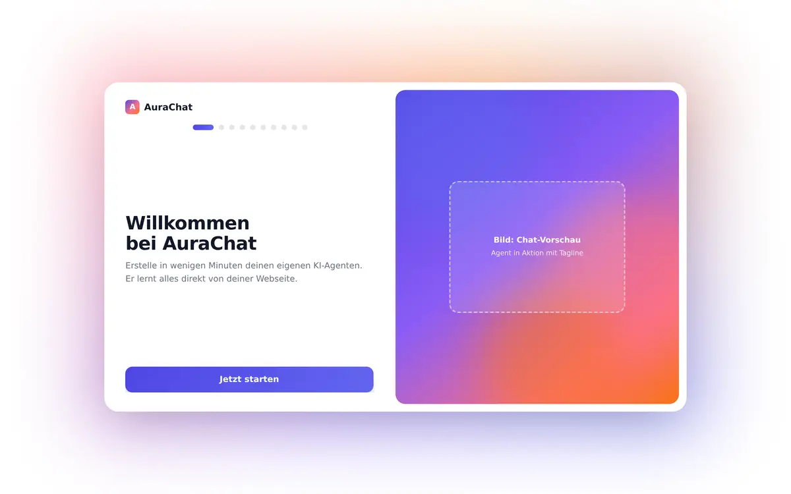
Kein Scrollen. Aber: 10 leere Punkte + „5 Minuten" — der Einstieg startet bei gefühlt 0 %.
**Vorschlag (Goal Gradient):** Balken mit Startwert, Phasen-Labels, „dauert ca. 3 Minuten". Zusatz (Loss-Aversion-freundlich): „Über 100 Firmen beantworten Kundenfragen schon automatisch."

### Schritt 1 — Anmelden 🔴 Mobile
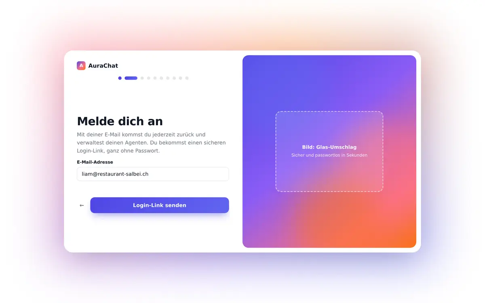 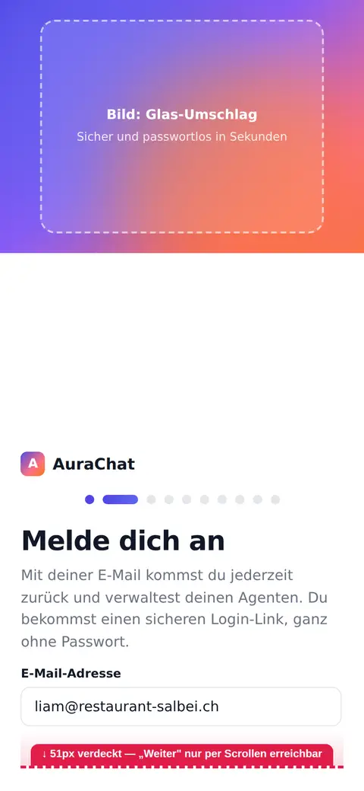
Auf Mobile liegt der einzige Aktions-Button (51 px) unter der Falz.
**Vorschlag (Reziprozität):** Schritt ganz nach hinter den Scan verschieben (siehe P3). Wenn er bleibt: Begründung geben („damit dein Agent gespeichert bleibt") — nicht einfach ein leeres Pflichtfeld.

### Schritt 2 — Webseite scannen ✅/🟡
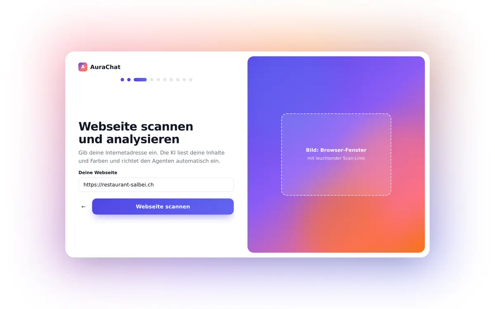
Okay. **Vorschlag (Reziprozität/IKEA):** Während des Scans live anzeigen, was gefunden wird („✓ Öffnungszeiten erkannt … ✓ 2 FAQs erkannt") — der Nutzer sieht zu, wie *sein* Agent entsteht, und der Übergang zu Schritt 3 fühlt sich wie ein Geschenk an.

### Schritt 3 — Stimmt das so? 🔴🔴 (schlimmster Schritt)
 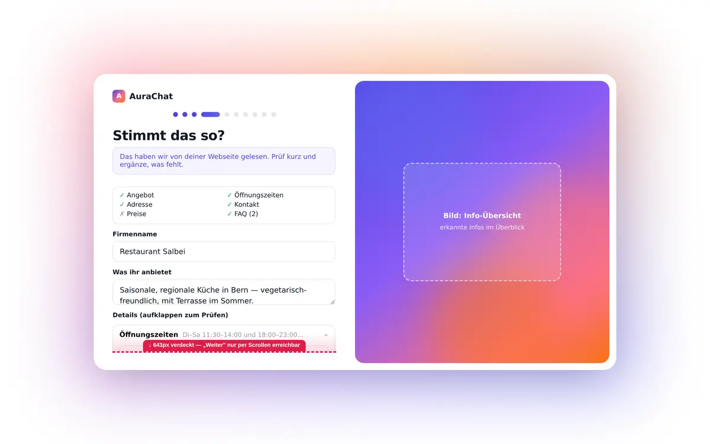 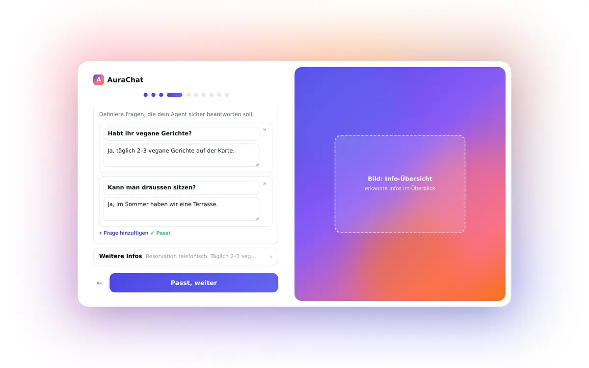
208 px verdeckt (Desktop, Karten zu), **643 px** sobald man die Karten zum Prüfen öffnet — genau das, wozu die Seite auffordert. Auf Mobile 404/859 px: Nutzer sehen nach Titel + Hinweisbox nicht einmal das erste Eingabefeld.
**Vorschläge:**
- **(Struktur)** Sticky Nav (P1) + die 4 Detail-Karten exklusiv öffnen (Akkordeon: eine offen, andere zu) — die Seite wächst nie um mehr als eine Kartenhöhe.
- **(IKEA/Endowment)** Framing drehen: nicht „Formular prüfen", sondern Besitz zeigen — „**Dein Agent kennt schon 6 Dinge über Restaurant Salbei**". Jede bestätigte Karte zählt sichtbar hoch (Wissens-Punkte). Der Scan-Bericht oben tut das schon fast — er sollte das Herz der Seite sein, nicht eine graue Box.
- **(Smart Defaults)** Erkannte Felder gelten als bestätigt (✓ vorausgewählt), nur Lücken („✗ Preise") fordern aktiv zum Ergänzen auf. 70–90 % ändern Defaults nie — zwinge niemanden, Erkanntes nochmal zu prüfen.

### Schritt 4 — Dokumente ✅/🔴 Mobile
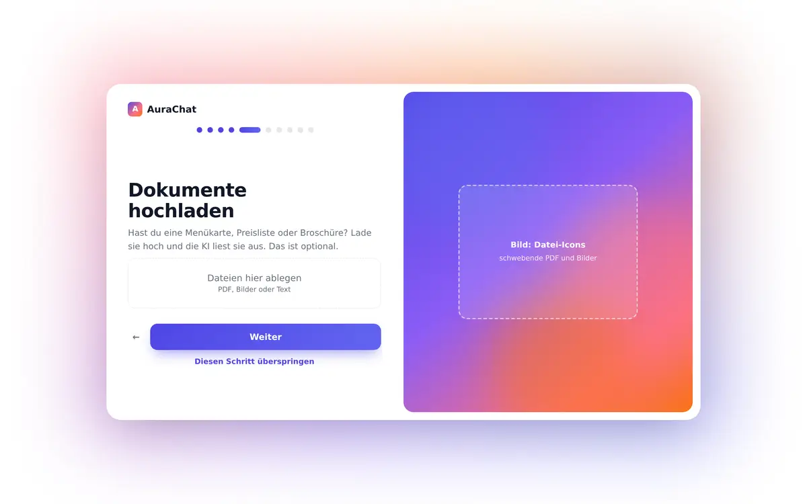
Desktop okay. Mobile: „Weiter" 88 px unter der Falz. **Vorschlag:** P1 genügt. Optional (Smart Defaults): „Überspringen" gleichwertig sichtbar machen — der Schritt ist optional, soll sich aber nicht als Hürde anfühlen.

### Schritt 5 — Wer ist dein Agent? 🔴
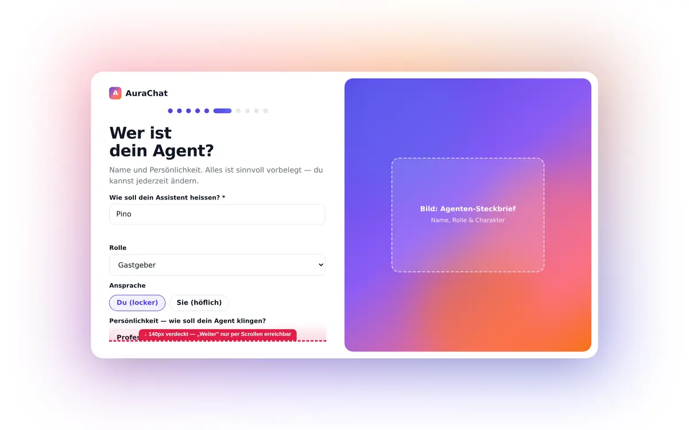 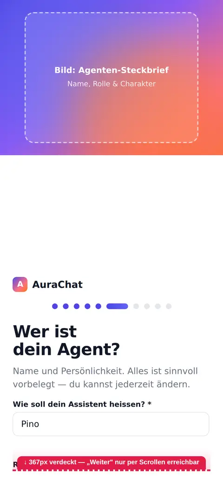
Desktop: 140 px verdeckt. Mobile: Nutzer sieht nur Titel + Namensfeld — Rolle, Ansprache, Persönlichkeit (367 px) sind unsichtbar.
**Vorschläge:**
- **(Smart Defaults)** Persönlichkeit hat als einzige Chip-Gruppe **keine Vorauswahl** — „Freundlich" mit „Empfohlen"-Badge vorwählen. Name wird bereits aus dem Firmennamen vorgeschlagen (gut!) — beibehalten und als Erfolg framen.
- **(Kontrasteffekt)** Die empfohlene Option visuell hervorheben statt 6 gleichwertige Chips — das Gehirn bewertet relativ.
- Kompakter: Rolle + Ansprache in eine Zeile, Chips zweispaltig.

### Schritt 6 — Wie soll er antworten? 🔴
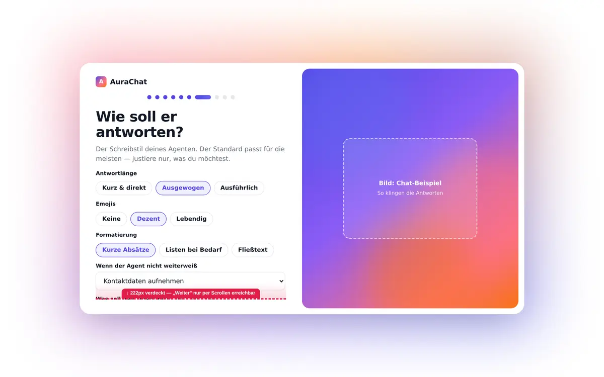 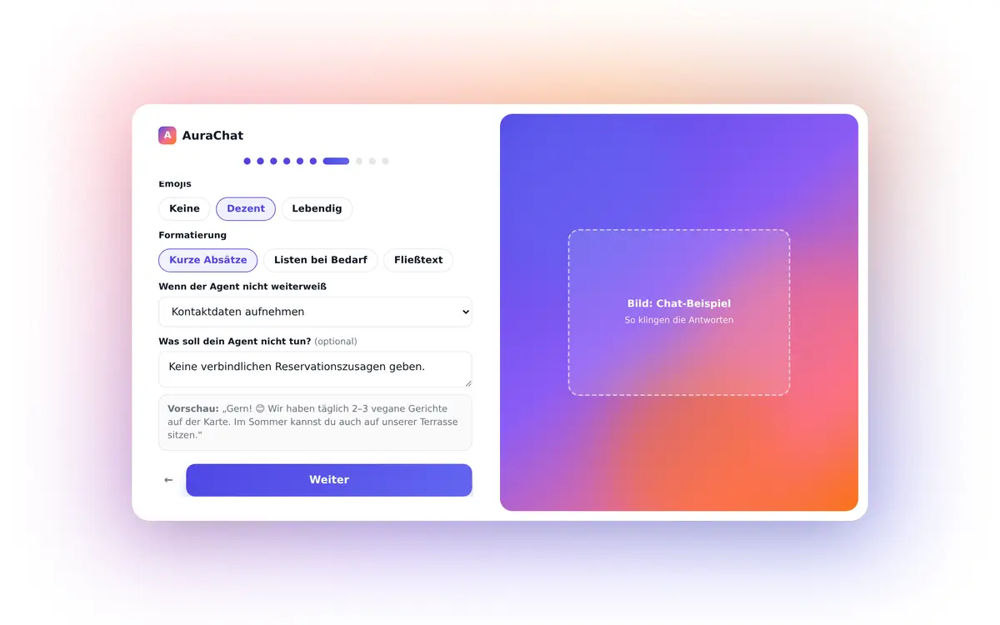
222/515 px verdeckt — 5 Entscheidungsgruppen auf einer Seite.
**Vorschlag (Smart Defaults, wichtigster Hebel):** Alles hier hat bereits sinnvolle Defaults („Der Standard passt für die meisten" steht wörtlich im Untertitel!). Konsequenz daraus ziehen: Seite auf **Vorschau + „Stil anpassen"-Aufklapper** reduzieren. Wer nichts ändert (die Mehrheit), klickt einfach weiter — Entscheidungsermüdung fällt weg, Scrollen auch.

### Schritt 7 — Chat-Design 🔴
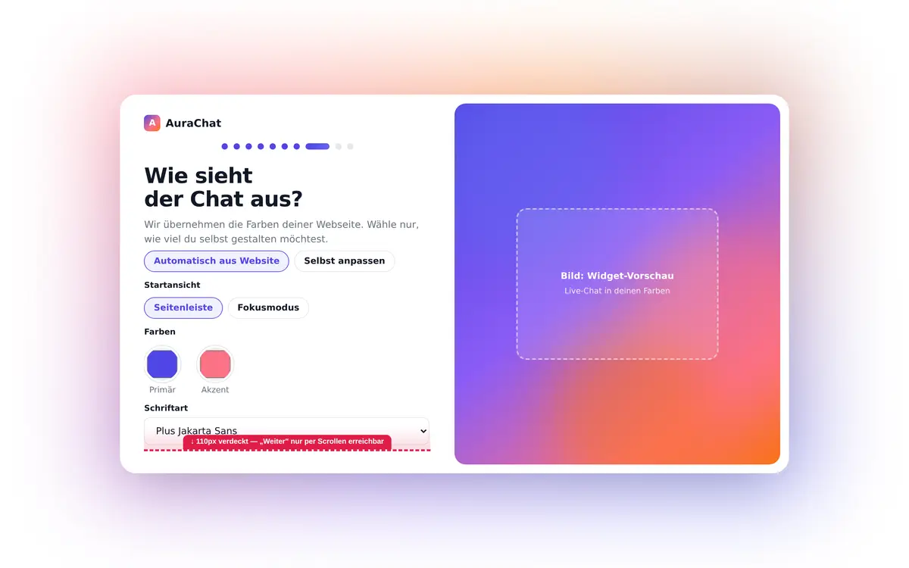 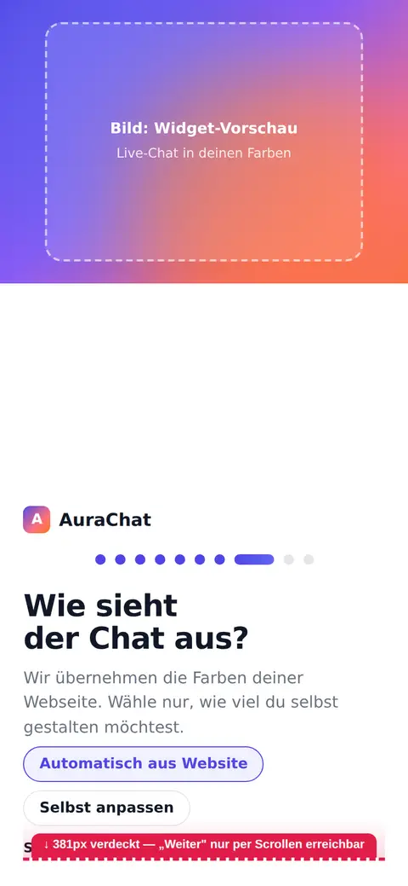
110/381 px verdeckt.
**Vorschlag (Smart Defaults + progressive Offenlegung):** „Automatisch aus Website" ist vorgewählt — dann dürfen Farben + Schriftart erst erscheinen, wenn „Selbst anpassen" gewählt wird. Der Schritt passt danach ohne Scrollen auf jede Bildschirmgrösse.

### Schritt 8 — Charakter erstellen 🔴🔴
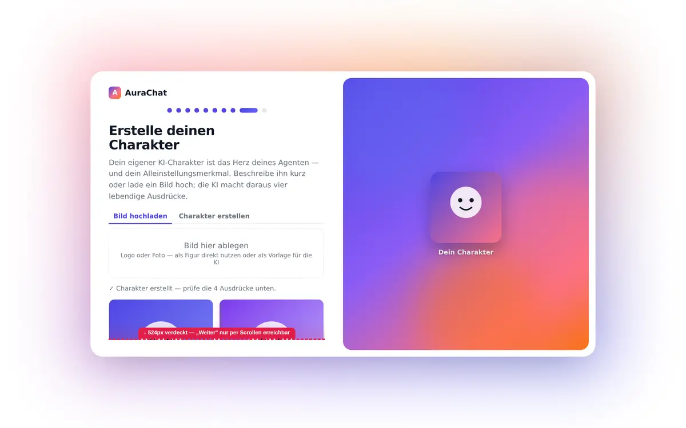 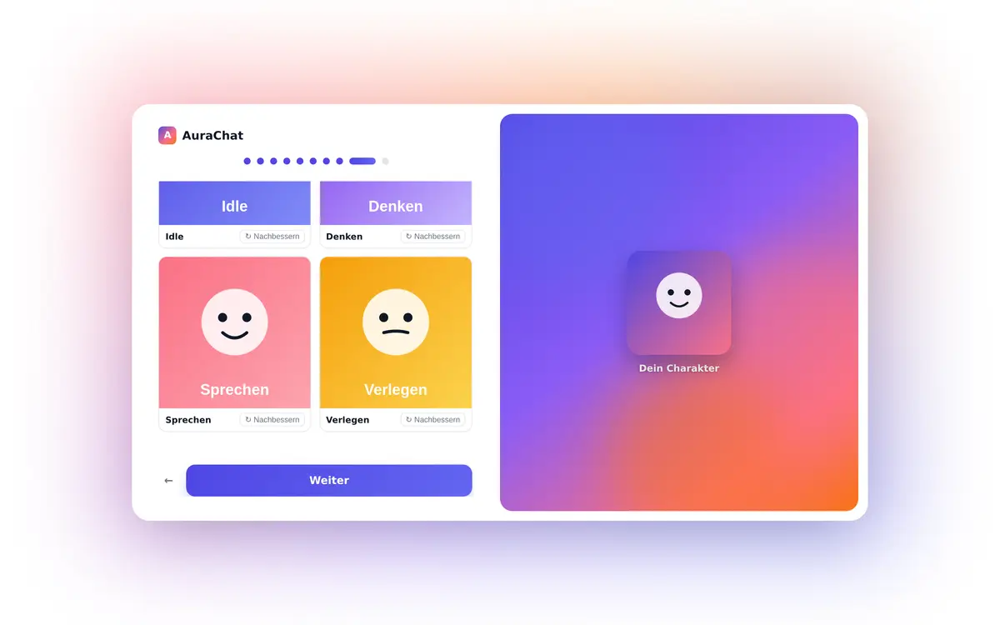
524/663 px verdeckt, sobald die 4 Ausdrücke generiert sind — der stolzeste Moment des Onboardings (das Produkt entsteht!) findet unterhalb der Falz statt. Der Pflicht-Hinweis bei „Weiter" ohne Charakter erscheint ebenfalls im unsichtbaren Bereich.
**Vorschläge:**
- **(Struktur)** Zustände ersetzen statt stapeln: Nach der Generierung ersetzt das Ausdrücke-Grid den Upload-/Beschreibungs-Bereich (mit „Neu erstellen"-Link), statt darunter zu erscheinen.
- **(IKEA-Effekt)** Diesen Schritt als Höhepunkt inszenieren: grosse Vorschau rechts (existiert schon — gut!), links nur der kompakte Editor. „Dein Charakter" ist das, was der Nutzer selbst gebaut hat — er trägt den Rest des Funnels.
- **(Goal Gradient)** Nach Generierung: „Fast geschafft — nur noch live schalten."

### Schritt 9 — Dein Agent ist bereit 🔴 (teuerster Fehler)
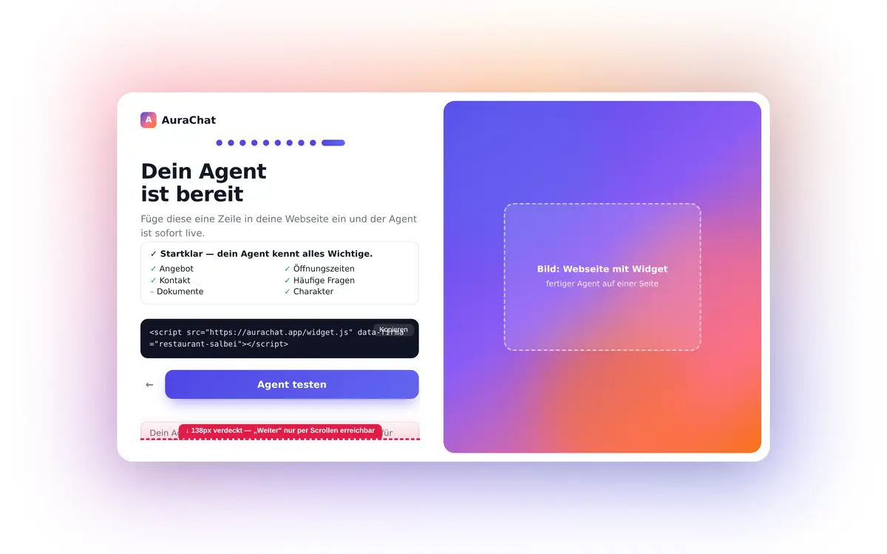 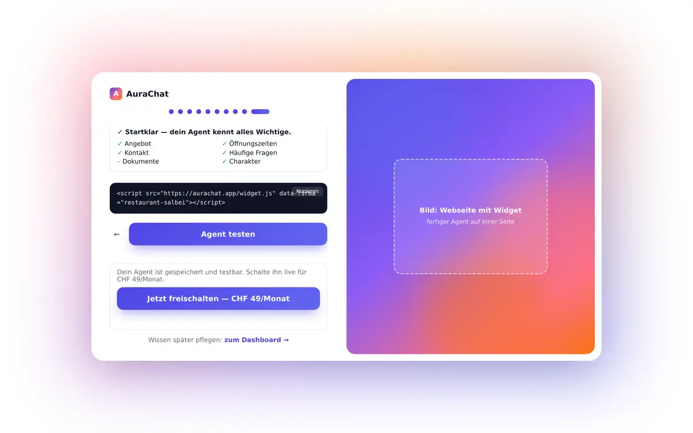 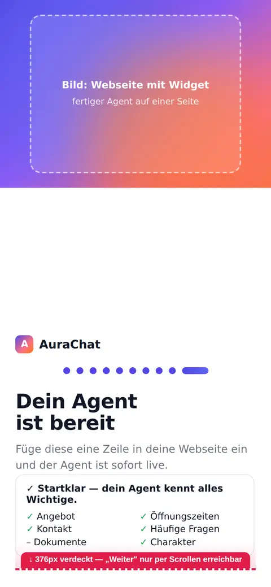
Desktop: der **Bezahl-Button** („Jetzt freischalten — CHF 49/Monat") liegt 138 px unter der Falz. Mobile: Embed-Code, „Agent testen" UND Checkout unsichtbar (376 px).
**Vorschläge:**
- **(Struktur)** Mit P1 + kompakter Checkliste gehört der Checkout in den sofort sichtbaren Bereich.
- **(Loss Aversion)** Checkout-Text konkret machen: statt neutralem Text → „**Pino** kennt deine Öffnungszeiten, 2 FAQs und deine Speisekarte. Schalte ihn live, bevor die Test-Session endet." Verlust wiegt doppelt so schwer wie Gewinn — benenne, was schon existiert und verloren ginge.
- **(Kontrasteffekt)** Preis mit Anker zeigen („statt CHF 89 Agentur-Setup — CHF 49/Monat, jederzeit kündbar").
- **(Goal Gradient)** Fortschritt hier sichtbar auf 100 % + Erfolgsmoment (Konfetti/Häkchen) — der Abschluss soll sich wie ein Gewinn anfühlen, nicht wie eine Rechnung.

---

## Alle Screenshots

| Schritt | Desktop | Mobile |
|---|---|---|
| 0 | [d-step0](bilder/d-step0.webp) | [m-step0](bilder/m-step0.webp) |
| 1 | [d-step1](bilder/d-step1.webp) | [m-step1](bilder/m-step1.webp) · [unten](bilder/m-step1-unten.webp) |
| 2 | [d-step2](bilder/d-step2.webp) | [m-step2](bilder/m-step2.webp) · [unten](bilder/m-step2-unten.webp) |
| 3 | [d-step3](bilder/d-step3.webp) · [unten](bilder/d-step3-unten.webp) · [offen](bilder/d-step3-offen.webp) · [offen-unten](bilder/d-step3-offen-unten.webp) | [m-step3](bilder/m-step3.webp) · [unten](bilder/m-step3-unten.webp) · [offen](bilder/m-step3-offen.webp) · [offen-unten](bilder/m-step3-offen-unten.webp) |
| 4 | [d-step4](bilder/d-step4.webp) | [m-step4](bilder/m-step4.webp) · [unten](bilder/m-step4-unten.webp) |
| 5 | [d-step5](bilder/d-step5.webp) · [unten](bilder/d-step5-unten.webp) | [m-step5](bilder/m-step5.webp) · [unten](bilder/m-step5-unten.webp) |
| 6 | [d-step6](bilder/d-step6.webp) · [unten](bilder/d-step6-unten.webp) | [m-step6](bilder/m-step6.webp) · [unten](bilder/m-step6-unten.webp) |
| 7 | [d-step7](bilder/d-step7.webp) · [unten](bilder/d-step7-unten.webp) | [m-step7](bilder/m-step7.webp) · [unten](bilder/m-step7-unten.webp) |
| 8 | [d-step8](bilder/d-step8.webp) · [unten](bilder/d-step8-unten.webp) | [m-step8](bilder/m-step8.webp) · [unten](bilder/m-step8-unten.webp) |
| 9 | [d-step9](bilder/d-step9.webp) · [unten](bilder/d-step9-unten.webp) | [m-step9](bilder/m-step9.webp) · [unten](bilder/m-step9-unten.webp) |
